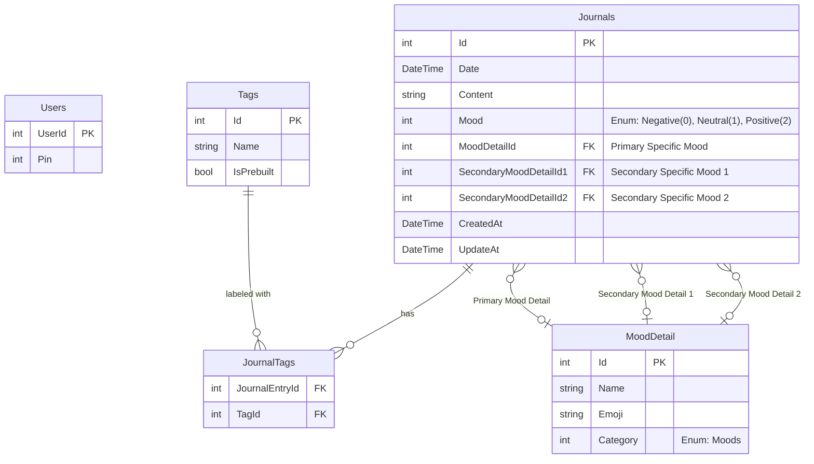

# Entity Relationship Diagram (ERD) - Journal App

## Visual Diagram (Mermaid)

## Entity Details

### 1. Users
Stores user authentication settings (currently just a PIN).
- **UserId** (`int`, PK): Unique identifier.
- **Pin** (`int`): 4-digit PIN for access.

### 2. Journals
Represents a daily journal entry.
- **Id** (`int`, PK): Unique identifier.
- **Date** (`DateTime`, Unique): The date of the entry. Only one entry per day.
- **Content** (`string`): The rich text content of the journal.
- **Mood** (`Moods Enum`): High-level mood category (Negative, Neutral, Positive).
- **MoodDetailId** (`int`, FK -> MoodDetail): The specific primary mood felt (e.g., "Happy").
- **SecondaryMoodDetailId1** (`int`, FK -> MoodDetail): Additional specific mood 1.
- **SecondaryMoodDetailId2** (`int`, FK -> MoodDetail): Additional specific mood 2.
- **CreatedAt** (`DateTime`): Timestamp of creation.
- **UpdateAt** (`DateTime`): Timestamp of last update.

### 3. MoodDetail
Defines specific feelings associated with broader categories.
- **Id** (`int`, PK): Unique identifier.
- **Name** (`string`): Name of the feeling (e.g., "Anxious", "Grateful").
- **Emoji** (`string`): Visual representation.
- **Category** (`Moods Enum`): The broad category this detail belongs to.

### 4. Tags
Labels to categorize entries by topic.
- **Id** (`int`, PK): Unique identifier.
- **Name** (`string`, Unique): Text label (e.g., "Work", "Family").
- **IsPrebuilt** (`bool`): Distinction between system-provided tags and user-created tags.

### 5. JournalTags
Junction table handling the Many-to-Many relationship between Journals and Tags.
- **JournalEntryId** (`int`, FK -> Journals): Reference to the journal entry.
- **TagId** (`int`, FK -> Tags): Reference to the applied tag.
